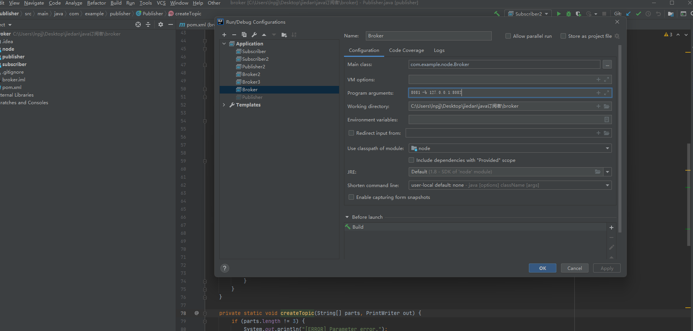

## 简介
发布者-订阅者（pub-sub）系统是分布式系统中广泛使用的架构模式，提供组件解耦、
可扩展性和实时通信等优点。这些系统允许发布者可以发送有关各种主题的消息，而
无需了解订阅者，订阅者可以接收更新在不知道出版商的情况下谈论他们感兴趣的主
题。在本次作业中，您将开发一个使用代理网络简化分布式发布者-订阅者 (pub-sub) 
系统，通过 Socket 实现编程或 RMI。系统应允许发布者和订阅者与代理网络进行交互
无缝支持多主题，方便实时消息分发

## 启动方式

### idea运行
用idea打开项目，在program arguments配置运行的参数。
broker的参数是"端口号 -b 其他broker的ip:端口号" 
订阅者的参数是"订阅者唯一用户名 连接的broker的ip:端口号"
发布者的参数是"发布者唯一用户名 连接的broker的ip:端口号"

### 打成jar包运行
1.用idea打开项目，右侧maven。找到broker->Lifecycle->package，双击打包。
2.打成的jar包分别在node,publisher,subscriber各自的target目录下。
3.用命令依次运行broker、订阅者、发布者的jar包，并加上一些运行参数。
broker的命令： java -jar broker.jar 端口号 -b 其他broker的ip:端口号
订阅者的命令： java -jar subscriber.jar 订阅者唯一用户名 连接的broker的ip:端口号
发布者的命令： java -jar publisher.jar 发布者唯一用户名 连接的broker的ip:端口号  

## 使用方式

项目运行起来后，一个简单的测试流程是这样的：
在发布者的控制台，创建一个主题：create 主题ID 主题名称
在订阅者的控制台，订阅主题：subscribe 主题ID 
在发布者的控制台，发送消息：publish 主题ID 消息主体
查看订阅者控制台，是否能接收到消息。

所有指令功能

发布者
创建主题: create 主题ID 主题名称
发布消息: publish 主题ID 消息主体
显示主题订阅者数量: show 主题ID
删除主题: delete 主题ID

订阅者
显示所有主题: display
订阅主题: subscribe 主题ID 
显示订阅者当前的订阅情况: current
取消订阅: unsubscribe 主题ID 

